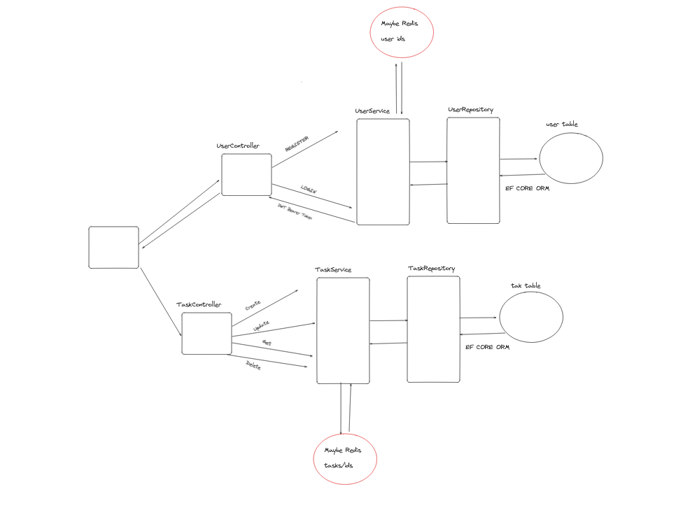

# TaskManager Interview Project
## Design



# Running the Project (Frontend + Backend + DB)

```docker-compose build```

```docker-compose up```

## IMPORTANT

- The first time probably docker-compose command will fail because the database is not ready yet. I did not have time
to modify the yml file to add proper health checks. You can run the command again and it should work.

```npm install && npm run dev```

You will be able to navigate at localhost:3000


# Running the Backend Local

##  Prerequisites
Install dotnet sdk 8, dotnet runtime  in your local machine and dotnet-ef tool
Be sure that you have postgres installed on your machine

```sudo apt-get update && sudo apt-get install -y dotnet-sdk-8.0```

```sudo apt-get install -y dotnet-runtime-8.0```

```dotnet tool install --global dotnet-ef```

## Run Migrations

```dotnet ef migrations add YourMigrationName --project ./TaskManager.Infrastructure --startup-project ./TaskManager.WebApi```

### Running the Application Locally
Do not forget to set the connection string in the appsettings.json file

```json
  "ConnectionStrings": {
    "DefaultConnection": "Host=localhost;Port=5432;Database=taskmanager;Username=postgres;Password=postgres"
  },
```

```dotnet run --project .\StealAllTheCats.WebApi\```

### Building the Application Locally

```dotnet build StealAllTheCats.sln```


# NOTES


- Endpoint documentation and is avaiable at http://localhost:8080/swagger/index.html 
- You can create user via Swagger at endpoint ```POST /api/Users```. Did not have the time to implement the frontend for this feature.
- While the docker compose is working well I had some issues while fetching data from the UI (CORS ERROR) which I could not solve. I am not sure if it is a problem with the docker compose or the code itself. 
I would suggest running the backend and frontend separately to avoid this issue.

- Test cases are not included in the project because 4 days for this project is ver strict. I would suggest using xUnit and Moq to test the application.
- I would suggest using a library like FluentValidation to validate the DTOs and entities. This will help to keep the code clean and maintainable.
- Maybe it is good idea to add a cache layer when retreiving users to see if they exist in the system